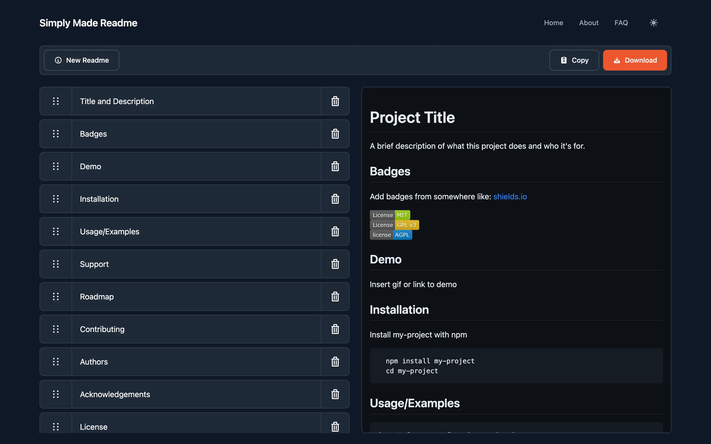

# simply-made-readme



**Free Online README Generator**  
Generate tailored, Markdown-formatted README files quickly and easily.


---

## Table of Contents

- [Overview](#overview)  
- [Features](#features)  
- [Demo / Preview](#demo--preview)  
- [Installation & Usage](#installation--usage)  
- [Development Setup](#development-setup)  
- [Testing](#testing)  
- [Deployment](#deployment)  
- [Contributing](#contributing)  
- [License](#license)  
- [Acknowledgments](#acknowledgments)

---

## Overview

**simply-made-readme** is a lightweight Svelte application that allows users to create README files using friendly, interactive templates. Built using JavaScript, TypeScript, and Svelte, it emphasizes simplicity, customizability, and ease of deployment.

---

## Features

- User-friendly, interactive interface for README creation  
- Supports Markdown output  
- Flexible templates and customization options  
- Built with modern web tech: Svelte, Vite, Tailwind  
- Seamless deployment (e.g., via Netlify)

---

## Demo / Preview

Try it out here:  
👉 [Live Demo](https://simplyreadme.netlify.app/)

---

## Installation & Usage

### Prerequisites

- Node.js (v14+)  
- npm, yarn, or pnpm

### Clone & Run Locally

```bash
git clone https://github.com/rabiibouhestine/simply-made-readme.git
cd simply-made-readme
npm install
npm run dev
```

Open [http://localhost:5173](http://localhost:5173) in your browser.

### Build for Production

```bash
npm run build
```

Serve the production build locally:

```bash
npm run preview
```

---

## Development Setup

- **Linting**: `npm run lint`  
- **Formatting**: Prettier is included  
- **Config files**:
  - `eslintrc.cjs` – ESLint config  
  - `.prettierrc` / `.prettierignore` – Prettier setup  
  - `tsconfig.json` – TypeScript config  
  - `playwright.config.ts` – E2E testing setup  
  - `netlify.toml` – Netlify deployment

---

## Testing

Run tests locally:

```bash
npm run test
```

For production build tests:

```bash
npm run test:build
```

This project uses Playwright for end-to-end testing.

---

## Deployment

Deployed on **Netlify**.

- Build command: `npm run build`  
- Publish directory: `dist`

Connect your GitHub repo to Netlify for automatic deployments on push.

---

## Contributing

Contributions are welcome!  

1. Fork the repo  
2. Create a feature branch (`git checkout -b feature/my-feature`)  
3. Commit changes (`git commit -m "Add feature"`)  
4. Push to your branch (`git push origin feature/my-feature`)  
5. Open a Pull Request  

Issues and feature requests are also appreciated.

---

## License

This project is licensed under the **MIT License**.  
See [LICENSE](LICENSE) for details.

---

## Acknowledgments

- [Awesome README](https://github.com/matiassingers/awesome-readme)  
- [makeareadme.com](https://www.makeareadme.com)  
- The open-source and Svelte communities for inspiration and support
